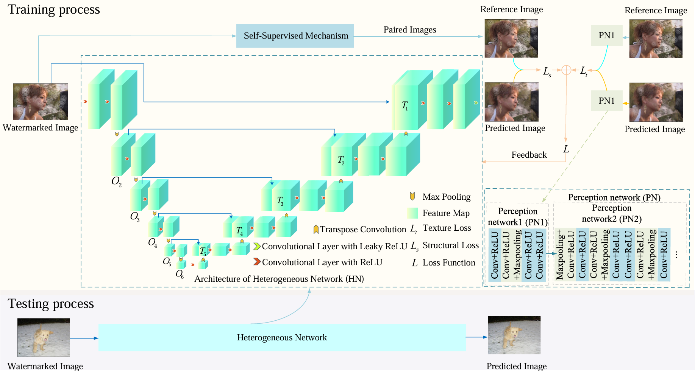

**This SWCNN uses a self-supervised way to construct reference watermarked images rather than given paired training samples, according to watermark distribution.** 

A heterogeneous U-Net architecture is used to extract more complementary structural information via simple components for image watermark removal. Taking into account texture information, a mixed loss is exploited to improve visual effects of image watermark removal. 

Experimental results show that the proposed SWCNN is superior to popular CNNs in image watermark removal.

This model is based on a paper by Chunwei Tian, Menghua Zheng, Tiancai Jiao, Wangmeng Zuo, Yanning Zhang, Chia-Wen Lin which can be found [here](https://arxiv.org/html/2403.05807v1).

This is a fork of the reference implementation of that paper aimed at improving:
__ToDo: List Improvements__

# Getting Started
## ToDo: Add steps for Installation, Training, Test and Inference

# Network architecture
